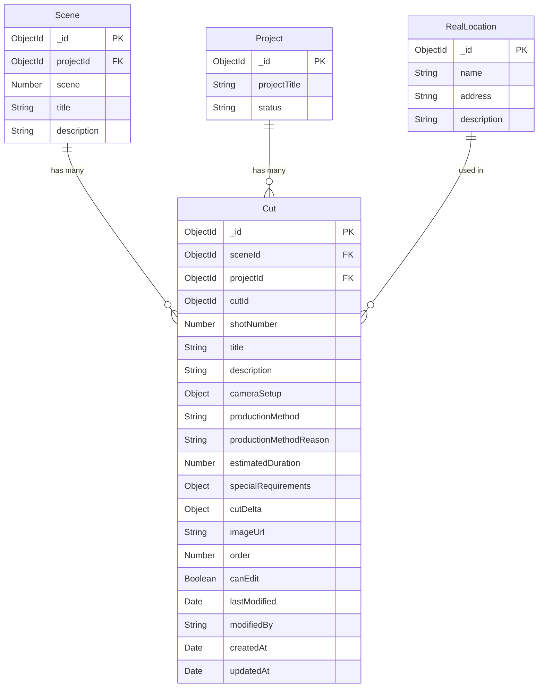

# Cut ERD (Entity Relationship Diagram)

## 📊 **Cut 모델 ERD**



## 🏗️ **Cut 스키마 구조**

### 📋 **기본 정보**
```javascript
Cut {
  _id: ObjectId (PK)
  sceneId: ObjectId (FK → Scene)
  projectId: ObjectId (FK → Project)
  cutId: ObjectId (고유 식별자)
  shotNumber: Number (샷 번호)
  title: String (컷 제목)
  description: String (컷 설명)
}
```

### 🎬 **카메라 설정 (Camera Setup)**
```javascript
Cut {
  cameraSetup: Object {
    shotSize: String (샷 사이즈)
      - EWS: Extreme Wide Shot (극광각샷)
      - VWS: Very Wide Shot (매우 광각샷)
      - WS: Wide Shot (광각샷)
      - FS: Full Shot (전신샷)
      - LS: Long Shot (원경샷)
      - MLS: Medium Long Shot (중원경샷)
      - MS: Medium Shot (중경샷)
      - MCS: Medium Close Shot (중근경샷)
      - CU: Close Up (근경샷)
      - MCU: Medium Close Up (중근경샷)
      - BCU: Big Close Up (대근경샷)
      - ECU: Extreme Close Up (극근경샷)
      - TCU: Tight Close Up (밀착근경샷)
      - OTS: Over The Shoulder (어깨너머샷)
      - POV: Point of View (시점샷)
      - TS: Two Shot (투샷)
      - GS: Group Shot (그룹샷)
      - AS: American Shot (아메리칸샷)
      - PS: Profile Shot (프로필샷)
      - BS: Bust Shot (버스트샷)
    
    angleDirection: String (앵글 방향)
      - Eye-level: Eye-level (시선높이)
      - High: High Angle (고각)
      - Low: Low Angle (저각)
      - Dutch: Dutch Angle (더치앵글)
      - Bird_eye: Bird's Eye (조감각)
      - Worm_eye: Worm's Eye (충시각)
      - Canted: Canted Angle (기울어진 앵글)
      - Oblique: Oblique Angle (사각)
      - Aerial: Aerial Angle (공중 앵글)
      - Ground: Ground Level (지면 레벨)
      - Overhead: Overhead (정상각)
      - Under: Under (저면각)
      - Side: Side Angle (측면각)
      - Front: Front Angle (정면각)
      - Back: Back Angle (후면각)
      - Three_quarter: Three-quarter Angle (3/4 앵글)
      - Profile: Profile Angle (프로필 앵글)
      - Reverse: Reverse Angle (역앵글)
      - POV: Point of View (시점 앵글)
      - Subjective: Subjective Angle (주관적 앵글)
    
    cameraMovement: String (카메라 움직임)
      - Static: Static (고정)
      - Pan: Pan (팬)
      - Tilt: Tilt (틸트)
      - Dolly: Dolly (돌리)
      - Zoom: Zoom (줌)
      - Handheld: Handheld (핸드헬드)
      - Tracking: Tracking Shot (트래킹샷)
      - Crane: Crane Shot (크레인샷)
      - Steadicam: Steadicam (스테디캠)
      - Gimbal: Gimbal (짐벌)
      - Drone: Drone (드론)
      - Jib: Jib (집)
      - Slider: Slider (슬라이더)
      - Dolly_zoom: Dolly Zoom (돌리줌)
      - Arc: Arc Shot (아크샷)
      - Circle: Circle Shot (서클샷)
      - Spiral: Spiral Shot (스파이럴샷)
      - Vertigo: Vertigo Effect (버티고 효과)
      - Whip_pan: Whip Pan (휩팬)
      - Crash_zoom: Crash Zoom (크래시줌)
      - Push_in: Push In (푸시인)
      - Pull_out: Pull Out (풀아웃)
      - Follow: Follow Shot (팔로우샷)
      - Lead: Lead Shot (리드샷)
      - Reveal: Reveal Shot (리빌샷)
      - Conceal: Conceal Shot (컨실샷)
      - Parallax: Parallax Shot (패럴랙스샷)
      - Time_lapse: Time Lapse (타임랩스)
      - Slow_motion: Slow Motion (슬로우모션)
      - Fast_motion: Fast Motion (패스트모션)
      - Bullet_time: Bullet Time (불릿타임)
      - Matrix_style: Matrix Style (매트릭스 스타일)
      - 360_degree: 360 Degree (360도)
      - VR_style: VR Style (VR 스타일)
    
    lensSpecs: String (렌즈 사양)
    cameraSettings: Object {
      aperture: String (조리개)
      shutterSpeed: String (셔터 스피드)
      iso: String (ISO)
    }
  }
}
```

### 🎭 **콘텐츠 정보**
```javascript
Cut {
  vfxEffects: String (VFX 효과)
  soundEffects: String (음향 효과)
  directorNotes: String (감독 노트)
  dialogue: String (대사)
  narration: String (내레이션)
  
  subjectMovement: Object {
    subjects: Array [{
      name: String (등장인물명/피사체명)
      type: String (피사체 타입: character, object, animal, background)
      position: String (위치: "중앙", "왼쪽", "오른쪽" 등)
      action: String (행동/움직임)
      emotion: String (감정 - 등장인물인 경우)
      description: String (피사체 설명)
    }]
  }
}
```

### 🎬 **제작 방법**
```javascript
Cut {
  productionMethod: String (제작 방법)
    - live_action: 실사 촬영
    - ai_generated: AI 생성
  
  productionMethodReason: String (제작 방법 선택 근거)
  estimatedDuration: Number (예상 지속 시간 - 초 단위)
}
```

### ⚡ **특수 요구사항 (Special Requirements)**
```javascript
Cut {
  specialRequirements: Object {
    specialCinematography: Object {
      drone: Boolean (드론 촬영)
      crane: Boolean (크레인)
      jib: Boolean (집)
      underwater: Boolean (수중 촬영)
      aerial: Boolean (공중 촬영)
    }
    
    specialEffects: Object {
      vfx: Boolean (VFX)
      pyrotechnics: Boolean (폭발 효과)
      smoke: Boolean (연기 효과)
      fog: Boolean (안개 효과)
      wind: Boolean (바람 효과)
      rain: Boolean (비 효과)
      snow: Boolean (눈 효과)
      fire: Boolean (불 효과)
      explosion: Boolean (폭발)
      stunt: Boolean (스턴트)
    }
    
    specialLighting: Object {
      laser: Boolean (레이저)
      strobe: Boolean (스트로브)
      blackLight: Boolean (블랙라이트)
      uvLight: Boolean (UV 라이트)
      movingLight: Boolean (무빙라이트)
      colorChanger: Boolean (컬러체인저)
    }
    
    safety: Object {
      requiresMedic: Boolean (의료진 필요)
      requiresFireSafety: Boolean (소방 안전 필요)
      requiresSafetyOfficer: Boolean (안전 담당관 필요)
    }
  }
}
```

### 📊 **Delta 계산 (Scene 대비 추가 요구사항)**
```javascript
Cut {
  cutDelta: Object {
    additionalCrew: Object {
      cinematography: Object {
        additionalCinematographer: Array (추가 촬영감독)
        additionalCameraOperator: Array (추가 카메라 오퍼레이터)
        additionalFirstAssistant: Array (추가 1st AC)
        additionalSecondAssistant: Array (추가 2nd AC)
        additionalDollyGrip: Array (추가 돌리 그립)
        droneOperator: Array (드론 조작자)
        craneOperator: Array (크레인 조작자)
        jibOperator: Array (집 조작자)
        underwaterOperator: Array (수중 촬영자)
        aerialOperator: Array (공중 촬영자)
      }
      
      lighting: Object {
        additionalGaffer: Array (추가 조명 감독)
        additionalBestBoy: Array (추가 베스트보이)
        additionalElectrician: Array (추가 조명 기술자)
        additionalGeneratorOperator: Array (추가 발전기 조작자)
        specialEffectsGaffer: Array (특수효과 조명기사)
        laserOperator: Array (레이저 오퍼레이터)
        strobeOperator: Array (스트로브 오퍼레이터)
        fogOperator: Array (안개 효과 오퍼레이터)
      }
      
      sound: Object {
        additionalSoundMixer: Array (추가 사운드 믹서)
        additionalBoomOperator: Array (추가 붐 오퍼레이터)
        additionalSoundAssistant: Array (추가 사운드 어시스턴트)
        additionalUtility: Array (추가 유틸리티)
        foleyArtist: Array (폴리 아티스트)
        ambienceRecordist: Array (환경음 녹음사)
        specialSoundEngineer: Array (특수 음향 엔지니어)
      }
      
      art: Object {
        additionalProductionDesigner: Array (추가 프로덕션 디자이너)
        additionalArtDirector: Array (추가 미술감독)
        additionalSetDecorator: Array (추가 세트 데코레이터)
        additionalPropMaster: Array (추가 소품감독)
        additionalMakeupArtist: Array (추가 분장사)
        additionalCostumeDesigner: Array (추가 의상디자이너)
        additionalHairStylist: Array (추가 헤어스타일리스트)
        vfxSupervisor: Array (VFX 감독)
        sfxSupervisor: Array (SFX 감독)
        pyrotechnician: Array (폭발 효과 기술자)
        stuntCoordinator: Array (스턴트 코디네이터)
        animatronicsOperator: Array (애니매트로닉스 조작자)
        prostheticsArtist: Array (특수 의상 아티스트)
        bloodEffectsArtist: Array (혈액 효과 아티스트)
        makeupEffectsArtist: Array (특수 분장 아티스트)
        setEffectsArtist: Array (세트 효과 아티스트)
        specialPropsMaster: Array (특수 소품 마스터)
        specialCostumeDesigner: Array (특수 의상 디자이너)
      }
      
      production: Object {
        additionalProducer: Array (추가 프로듀서)
        additionalLineProducer: Array (추가 라인 프로듀서)
        additionalProductionManager: Array (추가 제작 매니저)
        additionalProductionAssistant: Array (추가 제작 어시스턴트)
        safetySupervisor: Array (안전 감독)
        fireSafetyOfficer: Array (소화 안전 담당자)
        medic: Array (의료 담당자)
        emergencyCoordinator: Array (비상 조정자)
      }
      
      etc: Array (기타 특수 인력)
    }
    
    additionalEquipment: Object {
      cinematography: Object {
        additionalCameras: Array (추가 카메라 본체)
        additionalLenses: Array (추가 렌즈)
        additionalSupports: Array (추가 카메라 지지대)
        additionalFilters: Array (추가 필터)
        additionalAccessories: Array (추가 촬영 액세서리)
        drones: Array (드론)
        cranes: Array (크레인)
        jibs: Array (집)
        underwaterHousings: Array (수중 케이스)
        aerialRigs: Array (공중 장비)
      }
      
      lighting: Object {
        additionalKeyLights: Array (추가 메인광)
        additionalFillLights: Array (추가 보조광)
        additionalBackLights: Array (추가 배경광)
        additionalBackgroundLights: Array (추가 배경 조명)
        additionalSpecialEffectsLights: Array (추가 특수 효과 조명)
        additionalSoftLights: Array (추가 부드러운 조명)
        additionalGripModifiers: Object {
          flags: Array (추가 빛 차단)
          diffusion: Array (추가 빛 확산)
          reflectors: Array (추가 반사 판)
          colorGels: Array (추가 색상 필터)
        }
        additionalPower: Array (추가 전원 장비)
        specialKeyLights: Array (특수 메인광)
        specialFillLights: Array (특수 보조광)
        specialBackLights: Array (특수 배경광)
        specialBackgroundLights: Array (특수 배경 조명)
        specialEffectsLights: Array (특수 효과 조명)
        specialSoftLights: Array (특수 부드러운 조명)
        specialGripModifiers: Object {
          flags: Array (특수 빛 차단)
          diffusion: Array (특수 빛 확산)
          reflectors: Array (특수 반사 판)
          colorGels: Array (특수 색상 필터)
        }
        specialPower: Array (특수 전원 장비)
      }
      
      sound: Object {
        additionalMicrophones: Array (추가 마이크)
        additionalRecorders: Array (추가 녹음기)
        additionalWireless: Array (추가 무선 장비)
        additionalMonitoring: Array (추가 모니터링)
        foleyEquipment: Array (폴리 장비)
        ambienceRecorders: Array (환경음 녹음기)
        specialMicrophones: Array (특수 마이크)
        soundEffects: Array (음향효과 장비)
      }
      
      art: Object {
        additionalSetConstruction: Array (추가 세트 제작 도구)
        additionalProps: Object {
          additionalCharacterProps: Array (추가 인물 소품)
          additionalSetProps: Array (추가 공간 소품)
        }
        additionalSetDressing: Array (추가 세트 드레싱)
        additionalCostumes: Array (추가 의상)
        additionalSpecialEffects: Array (추가 특수효과)
        vfxEquipment: Array (VFX 장비)
        pyrotechnics: Array (폭발 효과 장비)
        smokeMachines: Array (연기 기계)
        fogMachines: Array (안개 기계)
        windMachines: Array (바람 기계)
        rainMachines: Array (비 효과 기계)
        snowMachines: Array (눈 효과 기계)
        animatronics: Array (애니매트로닉스)
        prosthetics: Array (의상 특수효과)
        bloodEffects: Array (혈액 효과)
        makeupEffects: Array (분장 효과)
        setEffects: Array (세트 효과)
        props: Object {
          characterProps: Array (인물 소품)
          setProps: Array (공간 소품)
        }
        costumes: Array (의상)
      }
      
      production: Object {
        additionalScheduling: Array (추가 스케줄링 도구)
        additionalSafety: Array (추가 안전 장비)
        additionalTransportation: Array (추가 운송 장비)
        safetyGear: Array (안전 장비)
        fireSuppression: Array (소화 장비)
        medicalEquipment: Array (의료 장비)
        emergencyEquipment: Array (비상 장비)
      }
      
      etc: Array (기타 특수 장비)
    }
  }
}
```

### 🖼️ **결과물 정보**
```javascript
Cut {
  imageUrl: String (컷 이미지 URL)
  order: Number (컷 순서)
  canEdit: Boolean (편집 권한)
  lastModified: Date (마지막 수정일)
  modifiedBy: String (수정자)
}
```

## 🔗 **관계 (Relationships)**

### 📊 **1:Many 관계**
- **Scene → Cut**: 하나의 씬은 여러 개의 컷을 가질 수 있음
- **Project → Cut**: 하나의 프로젝트는 여러 개의 컷을 가질 수 있음
- **RealLocation → Cut**: 하나의 실사 장소는 여러 컷에서 사용될 수 있음

### 🔄 **가상 필드 (Virtual Fields)**
```javascript
Cut {
  // 가상 필드들
  cutNumber: Number (컷 번호)
  durationFormatted: String (지속 시간 포맷)
}
```

## 📈 **인덱스 (Indexes)**
```javascript
// 성능 최적화를 위한 인덱스
Cut.index({ sceneId: 1, order: 1 })
Cut.index({ projectId: 1, status: 1 })
Cut.index({ 'shootingConditions.location': 1 })
Cut.index({ 'shootingConditions.timeOfDay': 1 })
Cut.index({ productionMethod: 1 })
```

## 🎯 **비즈니스 규칙 (Business Rules)**

### 📋 **데이터 무결성**
1. **필수 필드**: `sceneId`, `projectId`, `shotNumber`, `title`, `description`은 필수
2. **샷 번호**: `shotNumber` 필드는 1 이상의 양수
3. **지속 시간**: `estimatedDuration`은 1-300초 범위
4. **순서**: `order` 필드는 자동으로 `shotNumber` 값과 동기화

### 🔄 **자동화 규칙**
1. **순서 자동 설정**: 컷 저장 시 `order` 필드 자동 설정
2. **수정 기록**: 수정 시 `lastModified`와 `modifiedBy` 자동 업데이트
3. **가상 필드**: `cutNumber`와 `durationFormatted` 자동 계산

### 📊 **쿼리 최적화**
1. **씬별 조회**: `sceneId` 인덱스 활용
2. **순서별 정렬**: `order` 필드 기준 정렬
3. **제작 방법별 필터링**: `productionMethod` 인덱스 활용
4. **특수 요구사항별 필터링**: `specialRequirements` 필드 활용

## 🎬 **사용 시나리오**

### 📝 **컷 생성**
```javascript
// 새 컷 생성
const newCut = new Cut({
  sceneId: sceneId,
  projectId: projectId,
  shotNumber: 1,
  title: "주인공 클로즈업",
  description: "주인공의 감정을 표현하는 클로즈업",
  cameraSetup: {
    shotSize: 'CU',
    angleDirection: 'Eye-level',
    cameraMovement: 'Static'
  },
  productionMethod: 'live_action'
});
```

### 🔍 **컷 조회**
```javascript
// 씬의 모든 컷 조회
const cuts = await Cut.findBySceneId(sceneId);

// 특정 제작 방법의 컷들 조회
const aiCuts = await Cut.findByProductionMethod(projectId, 'ai_generated');

// 특정 장소의 컷들 조회
const locationCuts = await Cut.findByLocation(projectId, "서울시청");
```

### 📊 **통계 조회**
```javascript
// 씬별 컷 수 조회
const sceneWithCuts = await Scene.findById(sceneId).populate('cuts');

// 총 예상 지속 시간 계산
const totalDuration = sceneWithCuts.totalEstimatedDuration;
```

### 🎯 **특수 요구사항 관리**
```javascript
// 특수 촬영이 필요한 컷들 조회
const specialCuts = await Cut.find({
  'specialRequirements.specialCinematography.drone': true
});

// VFX가 필요한 컷들 조회
const vfxCuts = await Cut.find({
  'specialRequirements.specialEffects.vfx': true
});
```

이 ERD는 영화 제작에서 컷 단위의 세밀한 정보를 체계적으로 관리할 수 있도록 설계되었습니다. 특히 Scene의 기본 정보를 바탕으로 각 컷별로 추가되는 특수 요구사항과 Delta 정보를 체계적으로 관리할 수 있습니다. 