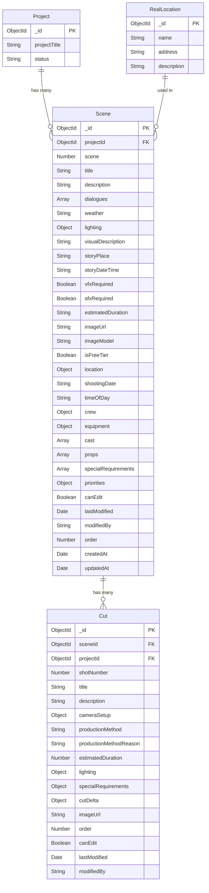

# Scene ERD (Entity Relationship Diagram)

## 📊 **Scene 모델 ERD**



## 🏗️ **Scene 스키마 구조**

### 📋 **기본 정보**
```javascript
Scene {
  _id: ObjectId (PK)
  projectId: ObjectId (FK → Project)
  scene: Number (씬 번호)
  title: String (씬 제목)
  description: String (씬 설명)
  dialogues: Array (대사 목록)
}
```

### 🌍 **환경 요소**
```javascript
Scene {
  weather: String (날씨)
  lighting: Object {
    description: String (조명 묘사)
    setup: Object {
      keyLight: Object (메인광)
      fillLight: Object (보조광)
      backLight: Object (배경광)
      backgroundLight: Object (배경 조명)
      specialEffects: Object (특수 조명)
      softLight: Object (부드러운 조명)
      gripModifier: Object (보조 도구)
      overall: Object (전체 설정)
    }
  }
  visualDescription: String (시각적 묘사)
  storyPlace: String (스토리 상의 장소)
  storyDateTime: String (스토리 상의 시간)
  vfxRequired: Boolean (VFX 필요 여부)
  sfxRequired: Boolean (SFX 필요 여부)
}
```

### 🎬 **제작 정보**
```javascript
Scene {
  estimatedDuration: String (예상 지속 시간)
  imageUrl: String (이미지 URL)
  imageModel: String (이미지 모델)
  isFreeTier: Boolean (무료 티어 여부)
}
```

### 📍 **스케줄링 정보**
```javascript
Scene {
  location: Object {
    name: String (촬영 장소명)
    realLocationId: ObjectId (FK → RealLocation)
  }
  shootingDate: String (촬영 날짜)
  timeOfDay: String (촬영 시간대)
}
```

### 👥 **인력 구성 (부서별)**
```javascript
Scene {
  crew: Object {
    direction: Object {
      director: String (감독)
      assistantDirector: String (조감독)
      scriptSupervisor: String (스크립트 슈퍼바이저)
      continuity: String (콘티뉴티)
    }
    production: Object {
      producer: String (프로듀서)
      lineProducer: String (라인 프로듀서)
      productionManager: String (제작 매니저)
      productionAssistant: String (제작 어시스턴트)
    }
    cinematography: Object {
      cinematographer: String (촬영감독)
      cameraOperator: String (카메라 오퍼레이터)
      firstAssistant: String (1st AC)
      secondAssistant: String (2nd AC)
      dollyGrip: String (돌리 그립)
    }
    lighting: Object {
      gaffer: String (조명 감독)
      bestBoy: String (베스트보이)
      electrician: String (조명 기술자)
      generatorOperator: String (발전기 조작자)
    }
    sound: Object {
      soundMixer: String (사운드 믹서)
      boomOperator: String (붐 오퍼레이터)
      soundAssistant: String (사운드 어시스턴트)
      utility: String (유틸리티)
    }
    art: Object {
      productionDesigner: String (프로덕션 디자이너)
      artDirector: String (미술감독)
      setDecorator: String (세트 데코레이터)
      propMaster: String (소품감독)
      makeupArtist: String (분장사)
      costumeDesigner: String (의상디자이너)
      hairStylist: String (헤어스타일리스트)
    }
  }
}
```

### 🛠️ **장비 구성 (부서별)**
```javascript
Scene {
  equipment: Object {
    direction: Object {
      monitors: Array (모니터링 시스템)
      communication: Array (통신 장비)
      scriptBoards: Array (스크립트 보드)
    }
    production: Object {
      scheduling: Array (스케줄링 도구)
      safety: Array (안전 장비)
      transportation: Array (운송 장비)
    }
    cinematography: Object {
      cameras: Array (카메라 본체)
      lenses: Array (렌즈)
      supports: Array (카메라 지지대)
      filters: Array (필터)
      accessories: Array (촬영 액세서리)
    }
    lighting: Object {
      keyLights: Array (메인광)
      fillLights: Array (보조광)
      backLights: Array (배경광)
      backgroundLights: Array (배경 조명)
      specialEffectsLights: Array (특수 효과 조명)
      softLights: Array (부드러운 조명)
      gripModifiers: Object {
        flags: Array (빛 차단)
        diffusion: Array (빛 확산)
        reflectors: Array (반사 판)
        colorGels: Array (색상 필터)
      }
      power: Array (전원 장비)
    }
    sound: Object {
      microphones: Array (마이크)
      recorders: Array (녹음기)
      wireless: Array (무선 장비)
      monitoring: Array (모니터링)
    }
    art: Object {
      setConstruction: Array (세트 제작 도구)
      props: Object {
        characterProps: Array (인물 소품)
        setProps: Array (공간 소품)
      }
      setDressing: Array (세트 드레싱)
      costumes: Array (의상)
      specialEffects: Array (특수효과)
    }
  }
}
```

### 🎭 **출연진 및 소품**
```javascript
Scene {
  cast: Array (출연진 목록)
  props: Array (소품 목록)
  specialRequirements: Array (특별 요구사항)
}
```

### ⚖️ **우선순위 및 권한**
```javascript
Scene {
  priorities: Object {
    location: Number (장소 우선순위)
    equipment: Number (장비 우선순위)
    cast: Number (출연진 우선순위)
    time: Number (시간 우선순위)
  }
  canEdit: Boolean (편집 권한)
  lastModified: Date (마지막 수정일)
  modifiedBy: String (수정자)
  order: Number (순서)
}
```

## 🔗 **관계 (Relationships)**

### 📊 **1:Many 관계**
- **Project → Scene**: 하나의 프로젝트는 여러 개의 씬을 가질 수 있음
- **Scene → Cut**: 하나의 씬은 여러 개의 컷을 가질 수 있음
- **RealLocation → Scene**: 하나의 실사 장소는 여러 씬에서 사용될 수 있음

### 🔄 **가상 필드 (Virtual Fields)**
```javascript
Scene {
  // 가상 필드들
  sceneNumber: Number (씬 번호)
  cuts: Array (컷 목록)
  cutCount: Number (컷 수)
  liveActionCutCount: Number (실사 촬영 컷 수)
  aiGeneratedCutCount: Number (AI 생성 컷 수)
  totalEstimatedDuration: Number (총 예상 지속 시간)
}
```

## 📈 **인덱스 (Indexes)**
```javascript
// 성능 최적화를 위한 인덱스
Scene.index({ projectId: 1, order: 1 })
Scene.index({ projectId: 1, type: 1 })
Scene.index({ 'location.name': 1 })
Scene.index({ shootingDate: 1 })
Scene.index({ cast: 1 })
```

## 🎯 **비즈니스 규칙 (Business Rules)**

### 📋 **데이터 무결성**
1. **필수 필드**: `projectId`, `scene`, `title`, `description`은 필수
2. **씬 번호**: `scene` 필드는 1 이상의 양수
3. **우선순위**: `priorities`의 모든 값은 1-5 범위
4. **순서**: `order` 필드는 자동으로 `scene` 값과 동기화

### 🔄 **자동화 규칙**
1. **순서 자동 설정**: 씬 저장 시 `order` 필드 자동 설정
2. **수정 기록**: 수정 시 `lastModified`와 `modifiedBy` 자동 업데이트
3. **가상 필드**: `cuts` 관계를 통한 컷 수 자동 계산

### 📊 **쿼리 최적화**
1. **프로젝트별 조회**: `projectId` 인덱스 활용
2. **순서별 정렬**: `order` 필드 기준 정렬
3. **장소별 필터링**: `location.name` 인덱스 활용
4. **날짜별 필터링**: `shootingDate` 인덱스 활용

## 🎬 **사용 시나리오**

### 📝 **씬 생성**
```javascript
// 새 씬 생성
const newScene = new Scene({
  projectId: projectId,
  scene: 1,
  title: "오프닝 씬",
  description: "주인공이 도시를 걸어가는 장면",
  crew: { /* 부서별 인력 */ },
  equipment: { /* 부서별 장비 */ }
});
```

### 🔍 **씬 조회**
```javascript
// 프로젝트의 모든 씬 조회
const scenes = await Scene.findByProjectId(projectId);

// 특정 장소의 씬들 조회
const locationScenes = await Scene.findByLocation(projectId, "서울시청");

// 특정 날짜의 씬들 조회
const dateScenes = await Scene.findByDate(projectId, "2024-01-15");
```

### 📊 **통계 조회**
```javascript
// 씬별 컷 수 조회
const sceneWithCuts = await Scene.findById(sceneId).populate('cuts');

// 총 예상 지속 시간 계산
const totalDuration = sceneWithCuts.totalEstimatedDuration;
```

이 ERD는 영화 제작 워크플로우에서 씬 단위의 모든 정보를 체계적으로 관리할 수 있도록 설계되었습니다. 